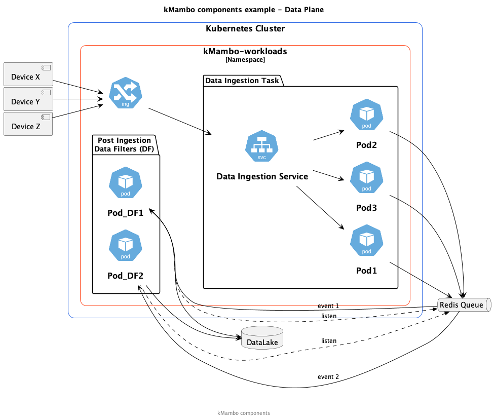

= kMambo

_A cloud-native task management and orchestration system_

== Overview

kMambo runs``jobs`` in a Kubernetes cluster.
Each `job` is composed of one or more ``tasks``.

A `task` is the smallest unit of work in a kMambo job and runs as a microservice.
To start a ``task``, you have to provide it with data - some would prefer to call it an `event`.
The data may be "pushed" to the `task` - for example, by way of an HTTP POST; or it may be "pulled" - for example, the data may be queued to a Redis queue or Kafka or GCP PubSub and the `task` will read from the queue when it is ready to read the data.
In this latter respect, it differentiates itself from https://xxx[kNative]
Once a ``task`` is triggered, it consumes the data and produces an output data which can be used to trigger the next `task` in the `job`.
As per usual, the output data can be "pushed" to or "pulled by" the next `task` in the job.
A kMambo `task` only cares about the data it is supposed to work on.
It cares not for who or what produced this data.
It also does not care who will consume the output data it creates.

A kMambo `job` is programmable.

- It does not specify a static sequence of `tasks`.
If anything, it allows conditional statements like `if-then-else` to specify the sequence of `tasks` in a `job`.
- It is possible to program to source of the data that triggers `tasks` and the destination of the output data
- Retry logic for a `task` is programmable.
- kMambo also handles `task` definition updates and graceful or abrupt `task` cancellations.

== Example

Picture a car company with a fleet of cars where sensors collect all sorts of data from their cars: periodic tire pressure measurements, fuel measurements, engine temperature measurements etc.

- The data is likely to be collected by each car and bundled together and pushed to the car company's cloud deployment, where it is collected in a data lake.
- Before the data can be persisted, depending on the privacy requirements of various jurisdictions, personally identifiable information (PII) may have to be stripped out.
- Additionally, non-PII information like vehicle location or speed may also need to be stripped out.
- Then, the persisted data is collectively analyzed for patterns to detect conditions like fuel mileage variations in different models and years of the cars.

In the image above,

. IoT devices in the field - embedded in cars in our case - collect all sorts of telemetry data and push to the Kubernetes cluster.
. The devices use HTTP for this push through an ingress controller.
. The ingress controller routes the incoming data to the `Data Ingestion Service` which round-robins the HTTP data to the pods of `Data Ingestion Task` which is a stateless replicaset.
These pods' only job is to quickly read, validate and queue the incoming data to the `Redis Queue`.
. It is from here that the pods of the replicaset `Post Ingestion Data Filters` read from the `Redis Queue` do the task of filtering out any data that is not allowed to keep - such as speed and location - and writes the remaining data to a data lake.

== kMambo Design
There are some drivers behind the design of kMambo - a set of goals that kMambo has to satisfy to justify its existence.

. We picture a small of maybe 2-3 engineers can build and operate a kMambo task cluster. It is that simple. Most of the heavy lifting will be done by kMambo's task orchestration.
. kMambo is a compact workflow design system, not unlike https://temporal.io[Temporal], except Temporal has more moving parts than kMambo and also kMambo is cloud native. More on that cloud-native bit:-
.. The execution sequence is a Kubernetes custom resource. So if you want to create a workflow you could simply do a
[source,shell]
kubectl apply -f kmambo workflow-1 workflow-and-task-file.yaml

.. Much like a Kubernetes deployment, you can update a kMambo workflow which creates a new version of the workflow
[source,shell]
kubectl edit kmambo workflow-1

.. and you can shut down the workflow by simply deleting the workflow
[source,shell]
kubectl delete kmambo workflow-1

. YAML is not the only way to declare workflows and tasks. You can define them using Pydantic models. In that case, you will not be able to use `kubectl` but you would have to use the kMambo client CLI (more on that later)

. kMambo tasks are event-driven.
.. Events can be pushed to a task through an Ingress or a Gateway
.. Events can be pulled by task pods (or more precisely, the task container within a pod) from a
   publish/subscribe (pub/sub) message broker such as RabbitMQ or GCP PubSub. _This is the preferred pattern._
. Service meshes are not necessary. The kMambo way is to favor using pub/sub to queue events and tasks act on (consume) events when they can.
.. This helps reduce running costs when not events are not necessarily time critical. It can become an operational
   decision as to what kind of Quality-of-Service to provide.

Let's work with the example above on how this becomes a kMambo-managed application.

We need to define 2 tasks, one for ingesting the data from the external source, as it were; and another for
filtering out all personally identifiable information (PII).

=== _Task 1 - IoT data ingestion task_
[source,yaml]
----
apiversion: kmambo.io/v1alpha1
kind: Task
metadata:
   name: iot-data-ingestion-task
spec:
   replicas: 30
   affinity: {}
   templates:
      imagePullSecret: []
      containers:
      - image: artifact-registry.kmambo.io/ingest-task-img:0.5
        imagePullPolicy: IfNotPresent
        command: ["httpserver"] 
        ports:
          - name: http
            containerPort: 8080
            protocol: TCP
        livenessProbe:
          httpGet:
            path: /livez
            port: http
        readinessProbe:
          httpGet:
            path: /readyz
            port: http
----

Of course, the same definition in the form of a Python class instance (behind the scenes, it's just a Pydantic V2 model ) would be
[source,python]
----
# tasks/iotingest.py
from kmambo import Task, HttpContainerTemplate, registry

template_ingest =  HttpContainerTemplate(
                     image="artifact-registry.kmambo.io/ingest-task-img:0.5",
                     command=["httpserver"] )
iot_ingest = Task(name="iot-data-ingestion-task", replicas=30, templates=[template_ingest],
               )
registry.register(iot_ingest)
----

Note that we are not under-specifying the container template in the Python model, it's just that the Python model has sane defaults. For example, the HTTP port is assumed to be 8080 in the container, the port name is assumed to be `http` and the liveness relative URL is at `/livez` and the readiness URL is at `/readyz` but all this can be easily overridden.

We will discuss the Python kMambo library and CLI executable later.

_Side note:_ One thing to note about using Python is that it lets you do much more than one can reasonably do using the declarative YAML approach. In fact, the Pythonic way is not truly declarative and that too is by design. In fact, we refer to it as the *enhanced mode*.

Likewise, let's define the PII filter task

=== _Task 2 - PII data filtration task_
[source,yaml]
----
apiversion: kmambo.io/v1alpha1
kind: Task
metadata:
   name: iot-data-pii-filter-task
spec:
   replicas: 30
   affinity: {}
   templates:
      imagePullSecret: []
      containers:
      - image: artifact-registry.kmambo.io/pii-filter-task-img:0.4
        imagePullPolicy: IfNotPresent
        command: ["piifilter"]
        ports:
          - name: http
            containerPort: 8080
            protocol: TCP
        livenessProbe:
          httpGet:
            path: /livez
            port: http
        readinessProbe:
          httpGet:
            path: /readyz
            port: http
----

[source,python]
----
# tasks/pii.py
from kmambo import Task, HttpContainerTemplate, registry

template_pii_filter =  HttpContainerTemplate(
image="artifact-registry.kmambo.io/pii-filter-task-img:0.4",
command=["piifilter"],

)
iot_pii_filter = Task(name="iot-data-pii-filter-task", replicas=30,
                      templates=[template_pii_filter])
registry.register(iot_pii_filter)
----

If you find the above two task objects similar to what a `Deployment` definition looks like, that is by design.
Behind the scenes, kMambo creates a `Deployment` and then lets the Kubernetes Control Plane manage this deployment. Where it starts to differ is in this: creating two ``Task``s alone will not create the said Deployment. One or more tasks need to brought together by a *``Workflow``*

=== _The IoT-to-datalake workflow_

Now we need to bring the 2 tasks above together.
[source, yaml]
----
apiversion: kmambo.io/v1alpha1
kind: Workflow
metadata:
  name: iot-data-ingestion-task
spec:
  tasks:
    - name: iot-data-ingestion-task
      namespace: iot-workflow-ns
      events:
        src:
          type: service
          name: iot-http-push
          init: true
        dst:
          type: queue
          name: iot-pubsub
    - name: iot-data-pii-filter-task
      namespace: iot-workflow-ns
      events:
        src:
          type: queue
          name: iot-pubsub
        dst:
          type: database
          name: iot-datalake
          final: true
----

And as per usual, there is a Python equivalent of the workflow and the message passing logic
[source, python]
---
# workflows/iotstore.py
from kmambo import Workflow, registry,
from .tasks import pii, iotingest
task1, task2 = registry["iot-data-ingestion-task"], registry["iot-data-pii-filter-task"]
workflow = Workflow()
---

      
What really ties one task to the next is that the output of the first task is sent to the input next one (PII filter)

Likewise, let's define the `queue` iot-pubsub. We want this to be a GCP PubSub queue
[source,yaml]
----
apiversion: kmambo.io/v1alpha1
kind: Queue
metadata:
  name: iot-pubsub
spec:
  topic: projects/partho-9a092/topics/skalar-sandbox
----

For the sake of completeness, let's define the Service which provides the starting point for all data that kicks of the workflow.
[source,yaml]
----
apiversion: kmambo.io/v1alpha1
kind: Service
metadata:
  name: iot-http-push
  namespace: iot-workflow-ns
spec:
  selector:
    app.kubernetes.io/name: iot-data-ingestion-task
  ports:
    - protocol: TCP
      port: 80
      targetPort: 8080
----

As things stand, we only support service-type `ClusterIP` only as of now.

Of course, we would still need an ingress or a gateway to allow traffic to reach the pods via the Service.

=== kMambo components

kMambo adheres to the https://kubernetes.io/docs/concepts/extend-kubernetes/operator/[Kubernetes operator pattern]. When deploying kMambo, we first install a set of kMambo CRDs  which define the scheme for kMambo `Task`s, `Workflow`s etc followed by a controller. The controller will monitor all the custom resources being created/edited/deleted to ensure the Workflows run as planned.

=== Library injection
What exactly did the `Service` or `Queue` definitions buy us? Well, they bought us a way for the task deployments to be mutated or more precisely, a way for the task pods to be mutated.
